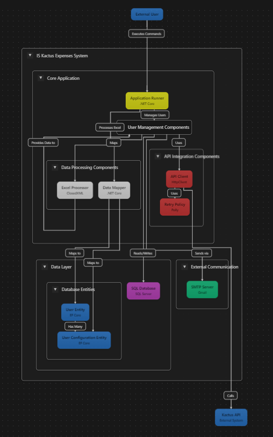

# Bogota-Profamilia-LegalizacionDeGastos-Kactus

Este proyecto es una solución para la gestión y legalización de gastos en la organización Profamilia, integrándose con el sistema Kactus. La aplicación permite la creación, actualización, así como la gestión de configuraciones asociadas a los permisos de los usuarios.

---

## Tabla de Contenidos
- [Características](#características)
- [Estructura del Proyecto](#estructura-del-proyecto)
- [Requisitos Previos](#requisitos-previos)
- [Configuración](#configuración)
- [Comandos Disponibles](#comandos-disponibles)
- [Detalles Técnicos](#detalles-técnicos)
- [Contribuciones](#contribuciones)
- [Licencia](#licencia)

---

## Características

- **Gestión de Usuarios**:
  - Creación de usuarios a partir de un archivo Excel.
  - Actualización de usuarios existentes.
  - Clonación de configuraciones de permisos entre usuarios.

- **Gestión de Configuraciones**:
  - Permite asignar configuraciones específicas a los usuarios.
  - Clonación de configuraciones desde usuarios maestros.
  - Eliminación de configuraciones existentes antes de asignar nuevas.

- **Integración con API**:
  - Consumo de servicios externos para obtener datos de usuarios.
  - Mecanismo de reintentos para manejar fallos en las llamadas API.

- **Optimización**:
  - Inserciones en lote para mejorar el rendimiento.
  - Uso de transacciones para garantizar la consistencia de los datos.

---

## Estructura del Proyecto

El proyecto está organizado de la siguiente manera:

```
IS_Kactus_Expenses/
├── Data/
│   ├── DataContext.cs          # Configuración del contexto de la base de datos
├── Model/
│   ├── Usuario.cs              # Modelo para la entidad Usuario
│   ├── UsuarioConfiguracion.cs # Modelo para la entidad Usuario_Configuracion
├── Service/
│   ├── UserService.cs          # Lógica de negocio para la gestión de usuarios
│   ├── UserRepository.cs       # Acceso a datos para usuarios y configuraciones
│   ├── ApplicationRunner.cs    # Punto de entrada para ejecutar comandos
├── Utils/
│   ├── Utils.cs                # Diccionarios y utilidades generales
├── Program.cs                  # Configuración principal y manejo de comandos
├── README.md                   # Documentación del proyecto
```

---

## Requisitos Previos

- **.NET 6.0 o superior**: Asegúrate de tener instalado el SDK de .NET.
- **Base de Datos**: La base de datos debe estar configurada con las tablas `Usuario` y `Usuario_Configuracion`.
- **Archivo de Configuración**: Un archivo `appsettings.json` con la configuración de la base de datos y la API.

---

## Configuración

1. **Clonar el repositorio**:
   ```bash
   git clone https://github.com/tu-repositorio/IS_Kactus_Expenses.git
   cd IS_Kactus_Expenses
   ```

2. **Configurar la base de datos**:
   - Asegúrate de que las tablas `Usuario` y `Usuario_Configuracion` existan en la base de datos.
   - Configura la cadena de conexión en `appsettings.json`.

3. **Compilar el proyecto**:
   ```bash
   dotnet build
   ```

4. **Ejecutar migraciones (si aplica)**:
   ```bash
   dotnet ef database update
   ```

---

## Comandos Disponibles

### 1. **Actualizar Usuarios**
Actualiza los usuarios existentes en la base de datos.

```bash
dotnet run -- update
```

### 2. **Crear Usuarios**
Crea nuevos usuarios a partir de un archivo Excel.

```bash
dotnet run -- create <ruta_al_archivo_excel>
```

Ejemplo:
```bash
dotnet run -- create "C:\Users\Usuario\Desktop\usuarios.xlsx"
```

### 3. **Clonar Configuraciones**
Clona las configuraciones de un usuario maestro a otro usuario.

```bash
dotnet run -- clone <targetUserId> <masterUserId>
```

Ejemplo:
```bash
dotnet run -- clone 5 1
```

---

## Detalles Técnicos

### 1. **Gestión de Usuarios**
- Los usuarios se crean o actualizan en la tabla `Usuario`.
- Los datos de los usuarios se obtienen de un archivo Excel o de una API externa.

### 2. **Gestión de Configuraciones**
- Las configuraciones se almacenan en la tabla `Usuario_Configuracion`.
- Antes de asignar nuevas configuraciones, las existentes se eliminan utilizando SQL directo para optimizar el rendimiento.

### 3. **Optimización**
- **Inserciones en Lote**: Se utiliza `AddRangeAsync` para insertar múltiples usuarios o configuraciones en una sola operación.
- **Transacciones**: Todas las operaciones críticas están envueltas en transacciones para garantizar la consistencia de los datos.

### 4. **Manejo de Errores**
- **Reintentos en API**: Se utiliza un mecanismo de reintentos para manejar fallos en las llamadas a la API.
- **Validaciones**: Se valida la existencia de usuarios antes de crearlos o actualizarlos.

---

## Contribuciones

¡Las contribuciones son bienvenidas! Si deseas contribuir, sigue estos pasos:

1. Haz un fork del repositorio.
2. Crea una rama para tu funcionalidad (`git checkout -b feature/nueva-funcionalidad`).
3. Realiza tus cambios y haz un commit (`git commit -m "Agrega nueva funcionalidad"`).
4. Envía un pull request.

---

## Licencia

Este proyecto está bajo la licencia [MIT](https://opensource.org/licenses/MIT).